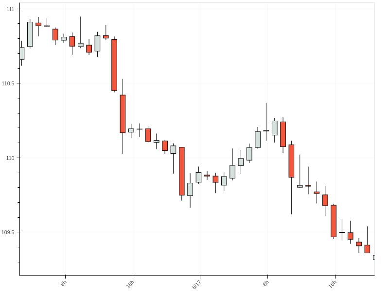
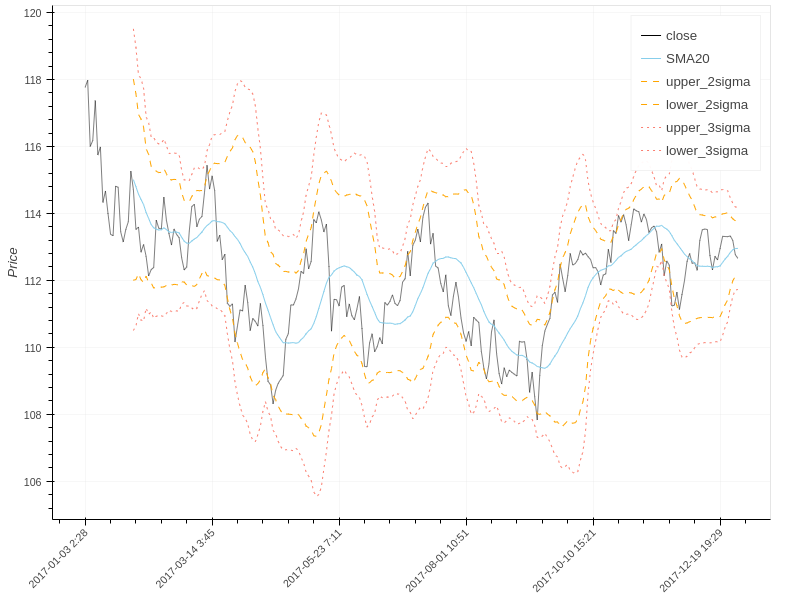
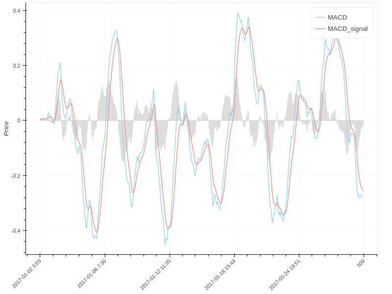
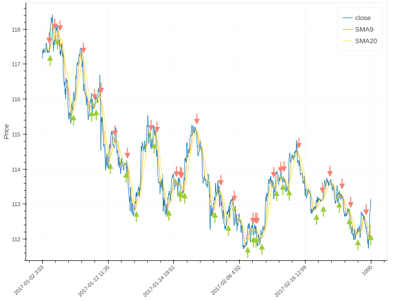
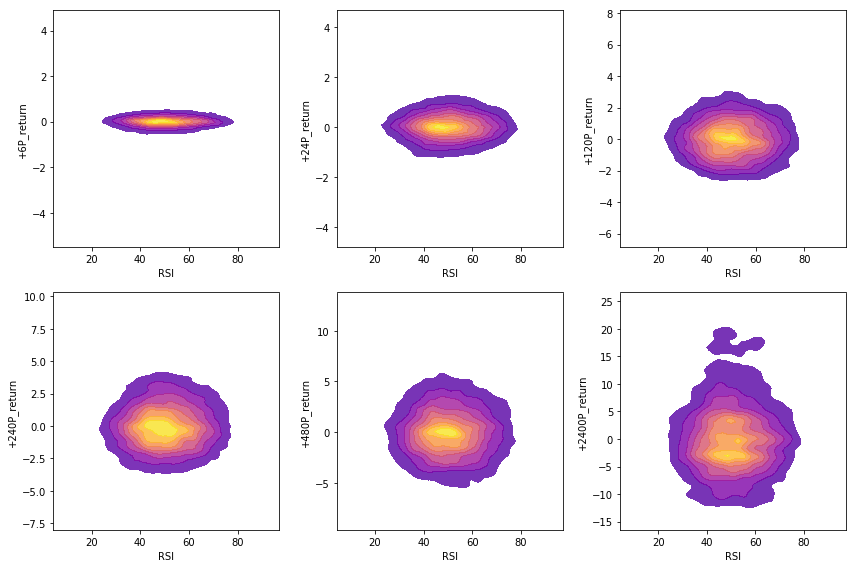

# technical_analysis

Goal of this project is to assess utility of widely used technical analysis
metrics.  
 
- Moving Average Crosses
- MACD
- Bollinger Bands
- CCI
- RSI

<b>Image Gallery</b> 
<i>Candlestick Chart</i> 

 
<i>Bollinger Bands</i> 

 
<i>MACD</i> 

 
<i>Moving Average Crosses</i> 

 
<i>RSI vs Returns</i> 

 
